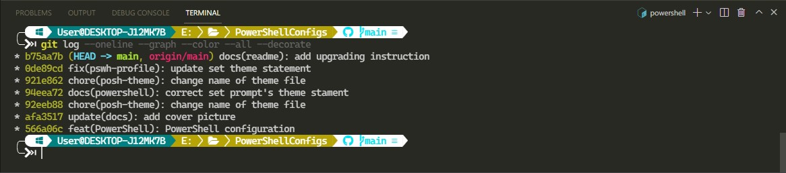

# POWERSHELL CONFIGURATION

## Cover



To make my **PowerShell** terminal be cool, I decided to customize it with plugins

- [Oh-my-posh](https://github.com/JanDeDobbeleer/oh-my-posh)
- [Terminal Icons](https://github.com/devblackops/Terminal-Icons)
- [PSReadLine](https://github.com/PowerShell/PSReadLine)

## Notes

Here is my OS and Powershell version, and all configuration here is only used for my OS.


## Modules

### Oh-my-posh

Oh My Posh is a custom prompt engine for any shell that has the ability to adjust the prompt string with a function or variable.

#### Installation

You can install oh-my-posh plugin via many terminal-platforms

- winget
- scoop
- ***powershell*** (*platform that I am introducing.*)
- chocolate
- homebrew
- zsh
- ...so on.

Run the command below in PowerShell terminal.

```powershell
PS> Install-Module oh-my-posh -Scope CurrentUser -Force
```

After installing, restart your PowerShell to download all themes and configs needed by oh-my-posh plugin.

Open or create a new `$PROFILE` for PowerShell, you can use any code editor such as **VSCode**, **Sublime Text**, **Vim**, ... I prefer using `notepad` for simple programming tasks.

```powershell
PS> notepad $PROFILE
```

Import oh-my-posh plugin to your `$PROFILE` before adding the line below

```powershell
Import-Module oh-my-posh
```

Set your preferred theme, ex: *agnoster theme*, add the new line below in `$PROFILE`

```powershell
Set-Prompt -Theme agnoster
```

### Terminal Icons

Run the command below to install Terminal-Icons plugin from PowerShell

```powershell
PS> Install-Module -Name Terminal-Icons -Scope CurrentUser -Repository PSGallery -Force
```

Add the newline below to `$PROFILE`

```powershell
Import-Module -Name Terminal-Icons
```

### PSReadLine

Run the command below to install Terminal-Icons plugin from PowerShell

```powershell
PS> Install-Module -Name PSReadLine -AllowPrerelease -Scope CurrentUser -Force
```

Add the newline below to `$PROFILE`

```powershell
Import-Module PSReadLine
```

#### Usage (my configs)

Add to `$PROFILE`

```powershell
Set-PSReadLineKeyHandler -Key Tab -Function MenuComplete
Set-PSReadLineKeyHandler -Key UpArrow -Function HistorySearchBackward
Set-PSReadLineKeyHandler -Key DownArrow -Function HistorySearchForward
Set-PSReadLineOption -ShowToolTips
Set-PSReadLineOption -PredictionSource History
```

## Create your own theme and `import` to your `$PROFILE`

Run the command below to show all built-in themes

```powershell
PS> Get-PoshTheme
```

Maybe there's a theme you like, but you don't fancy the colors. Or, maybe there's a segment you want to tweak/add, or replace some of the icons with a different one. Whatever the case, read through all available options first, by starting with the [configuration guide](https://ohmyposh.dev/docs/config-overview)

I created a theme called `swiftman` and store it on `~/PoshCustomThemes` folder. So to use my custom theme, I run the command below

```powershell
Export-PoshTheme -FilePath "~/PoshCustomThemes/.swiftman.omp.json" -Format json
```

then add the newline below to `$PROFILE`

```powershell
Set-PoshPrompt -Theme ~/PoshCustomThemes/.my_agnoster.omp.json
```
